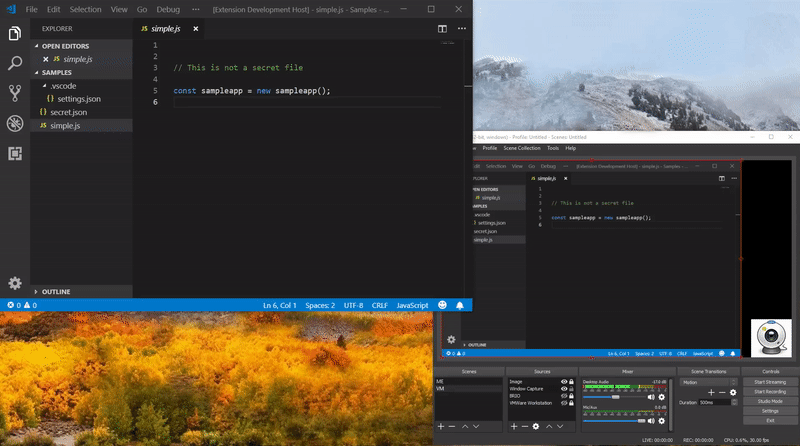

# vscode-obs-websockets-secretsswitchscene
A Microsoft Visual Studio Code extension to switch OBS Studio scenes when you open a filename which has been designated to have secrets within its contents.

Master | Dev
:---: | :---:
 | 

## Features

- Start a connection to OBS using the command `Start connection to OBS-Studio`
- Stop a connection to OBS using the command `Stop connection to OBS-Studio`
- Set the websocket password in your secure store `Set the OBS Websocket password`
- Delete the websocket password from your secure store `Delete the OBS Websocket password`
- Add selected file(s) to the fileNames workspace setting `Add file(s) to OBS Auto Switch Scene settings`
- Remove selected file(s) from the fileNames workspace setting `Remove file(s) from OBS Auto Switch Scene settings`
- Switches scenes if the filename opened by the editor matches filenames set in your workspace settings. These filenames can be in glob format (ie **/appsettings.json).
- Switches scenes without any transition in order to ensure the scene switches as quickly as possible.
- Automatically switches back to the original scene when you either close or switch tabs from the filename identified above.

## Requirements

This extension has a dependency on the following OBS plugin: [OBS-WebSocket 4.4.0](
https://github.com/Palakis/obs-websocket)

## Extension Settings

This extension contributes the following settings:

* `obs.secretsSwitchScene.socketsUrl`: The OBS Websocket URL and Port. (localhost:4444)
* `obs.secretsSwitchScene.fileNames`: A list of filenames that contain secrets.
* `obs.secretsSwitchScene.scene`: The scene to automatically switch to if a file containing secrets is opened.
* `obs.secretsSwitchScene.autoSwitchBack`: Automatically switch back to the previous scene after you close the file containing secrets.
* `obs.secretsSwitchScene.usePassword`: Whether or not to use a password to connect to OBS using your OS' password store.

## Known issues

* None at this time

## Release Notes

### 0.3.0

Added CredentialManager which will store the users Websocket password in the OS' secure store. We utilize NodeJS keytar module to assist us in adding and removing the password from the users secure store. _See_ [node-keytar](https://github.com/atom/node-keytar)

### 0.2.0

Added a status bar indicator to VSCode

### 0.1.0

Added the ability for the extension to manage the connection state and try to reconnect up to 5 times.
Also added commands to start and stop the connection manually.

### 0.0.1

Initial release
